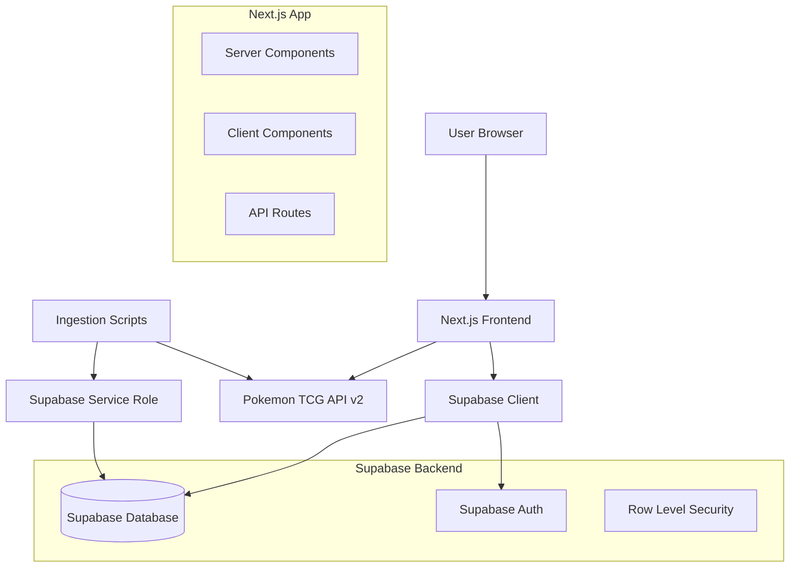
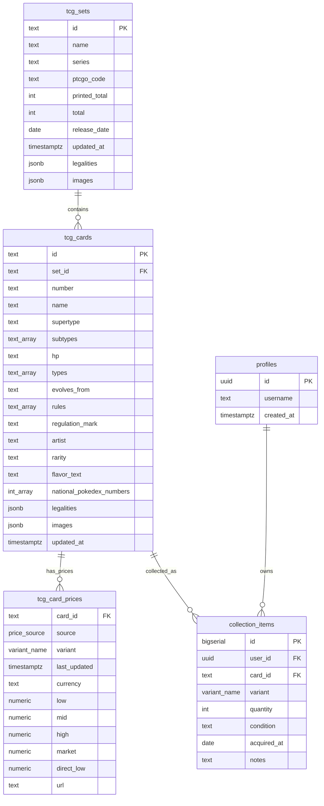
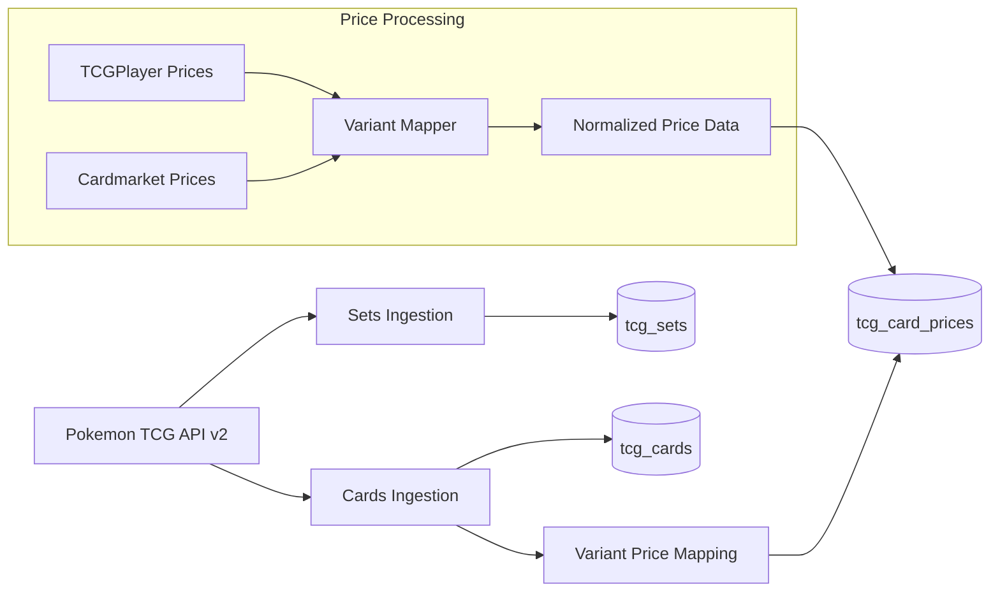
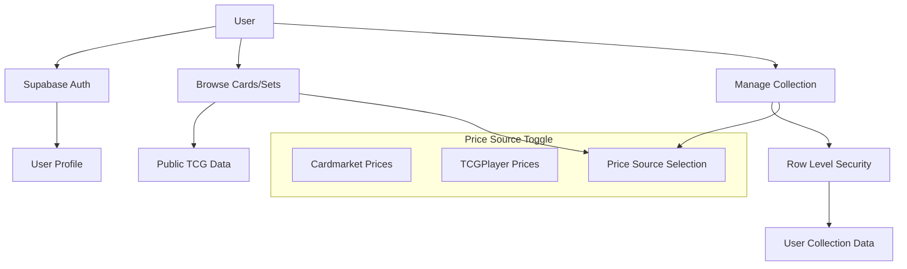
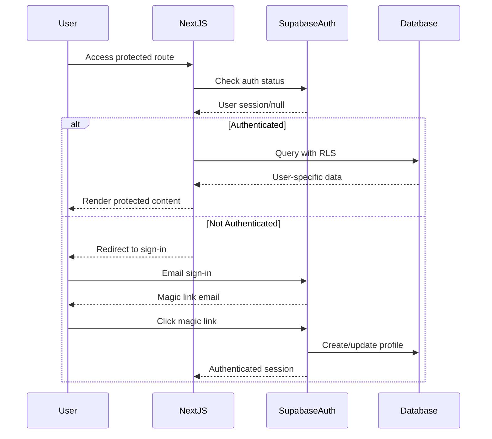
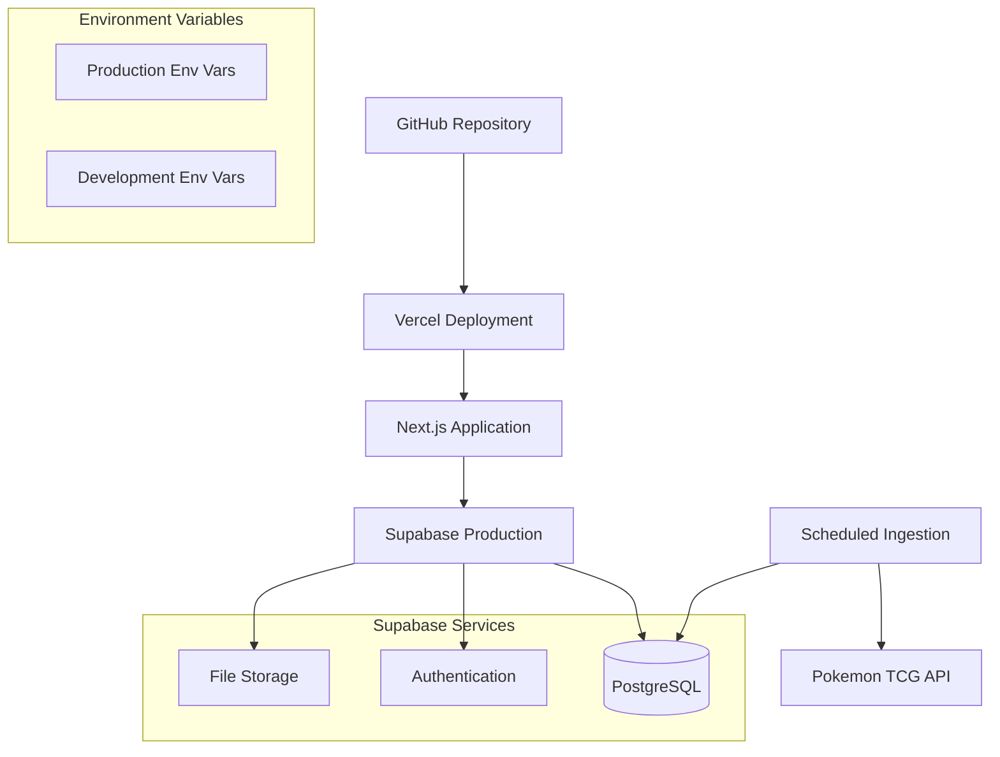

# Lumidex v2 - System Architecture

## Overview

Lumidex v2 is a full-stack Pokemon TCG collection management application built with modern web technologies. It provides users with the ability to browse Pokemon cards, track their collection, and view real-time pricing data from multiple sources.

## Technology Stack

- **Frontend**: Next.js 14 (App Router), TypeScript, Tailwind CSS
- **Backend**: Next.js API Routes, Server Components
- **Database**: Supabase (PostgreSQL with Row Level Security)
- **Authentication**: Supabase Auth (Email Magic Links)
- **External API**: Pokemon TCG API v2
- **Deployment**: Vercel (Frontend) + Supabase (Backend Services)
- **Package Manager**: npm

## System Architecture



## Database Schema

### Core Entities



### Enums

- **variant_name**: `normal`, `holofoil`, `reverse_holofoil`, `first_edition_normal`, `first_edition_holofoil`, `unlimited`
- **price_source**: `cardmarket`, `tcgplayer`

### Access Control

- **Public Tables** (no RLS): `tcg_sets`, `tcg_cards`, `tcg_card_prices`
- **User Tables** (RLS enabled): `profiles`, `collection_items`

## Data Flow Architecture

### Ingestion Pipeline



### User Data Flow



## Component Architecture

### App Router Structure

```
src/app/
├── (site)/
│   ├── layout.tsx           # Main layout with nav & price toggle
│   ├── page.tsx            # Landing page
│   ├── sets/
│   │   ├── page.tsx        # Sets listing
│   │   └── [id]/
│   │       └── page.tsx    # Set details with cards
│   ├── cards/
│   │   └── page.tsx        # Cards search & browse
│   └── collection/
│       └── page.tsx        # User collection (auth required)
└── api/                    # API routes (if needed)
```

### Key Components

- **Server Components** (default): Page layouts, data fetching, static content
- **Client Components**: Interactive forms, toggles, real-time updates, search filters

## Authentication & Authorization

### Supabase Auth Integration



### RLS Policies

- **profiles**: Users can only access their own profile data
- **collection_items**: Users can only CRUD their own collection items

## Variant Normalization System

### External to Internal Mapping

```typescript
// TCGPlayer → Internal
const tcgplayerVariants = {
  'normal': 'normal',
  'holofoil': 'holofoil', 
  'reverseHolofoil': 'reverse_holofoil',
  '1stEditionNormal': 'first_edition_normal',
  '1stEditionHolofoil': 'first_edition_holofoil',
  'unlimited': 'unlimited'
}

// Cardmarket → Internal  
const cardmarketVariants = {
  'normal': 'normal',
  'holofoil': 'holofoil',
  'reverseHolofoil': 'reverse_holofoil', 
  'unlimited': 'unlimited'
  // Note: Cardmarket 1st edition mapped to normal/holofoil
}
```

## Performance Strategy

### Database Optimizations

- **Indexes**: 
  - `tcg_sets.release_date` for chronological queries
  - `tcg_cards.set_id` for set-based filtering
  - `tcg_cards.updated_at` for incremental ingestion
  - GIN index on `tcg_cards.types` for array searches
  - Composite index on `tcg_card_prices(source, variant)`

### Caching Strategy

- **Static Generation**: Sets and cards pages with ISR
- **Server Components**: Default for data fetching
- **Client Components**: Minimal, only for interactivity

## Deployment Architecture



### Environment Configuration

**Required Environment Variables:**
- `NEXT_PUBLIC_SUPABASE_URL`
- `NEXT_PUBLIC_SUPABASE_ANON_KEY`
- `SUPABASE_SERVICE_ROLE_KEY` (server-side only)
- `SUPABASE_PROJECT_REF`
- `POKEMONTCG_API_KEY`
- `NEXT_PUBLIC_APP_URL`
- `NODE_ENV`

## Implementation Phases

### Phase 1: Foundation
- Project setup and repository creation
- Database schema and migrations
- Supabase integration
- Basic project structure

### Phase 2: Data Layer
- Variant normalization system
- Ingestion scripts for sets and cards
- Price data processing
- Data validation and error handling

### Phase 3: Core Features
- Main layout and navigation
- Sets browsing and details
- Cards search and filtering
- Price source toggle implementation

### Phase 4: User Features  
- Authentication integration
- User profiles and collection management
- CRUD operations for collection items
- Collection value calculations

### Phase 5: Polish & Deploy
- Performance optimizations
- Documentation and README
- Vercel deployment configuration
- Acceptance testing and validation

## Success Criteria

1. **Data Integrity**: All Pokemon TCG data properly ingested without constraint errors
2. **Authentication**: Secure user authentication with proper RLS enforcement
3. **Price Accuracy**: Correct variant mapping and price display from both sources
4. **Performance**: Fast page loads and responsive user interactions
5. **Deployment**: Successful production deployment with proper environment configuration

This architecture provides a solid foundation for building a scalable, maintainable Pokemon TCG collection management application with modern web development best practices.