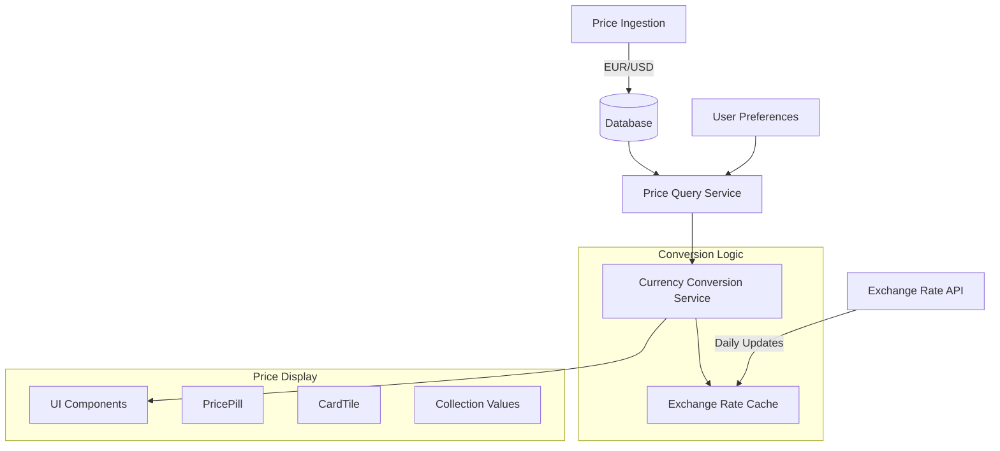

# Currency Conversion System Implementation Plan

## Overview

This document outlines the implementation plan for a currency conversion system that will display prices in users' preferred currencies. The system needs to handle conversion between stored price currencies (EUR for Cardmarket, USD for TCGPlayer) and user-preferred display currencies (EUR, USD, GBP, NOK).

## Current System Analysis

### Database Structure
- **`tcg_card_prices`** table stores prices with `currency` field
  - Cardmarket prices stored in EUR
  - TCGPlayer prices stored in USD
- **`profiles`** table contains user preferences:
  - `preferred_currency`: CurrencyCode (EUR, USD, GBP, NOK)
  - `preferred_price_source`: PriceSource (cardmarket, tcgplayer)

### Price Display Components
- **`PricePill`** component formats prices using `Intl.NumberFormat`
- **`CardTile`** component displays prices from different sources
- **`formatCurrency`** utility function for consistent formatting

### Current Price Flow
1. Prices ingested → Database (EUR/USD)
2. User selects price source + preferred currency
3. Prices displayed → **Missing conversion logic**

## System Architecture



## Implementation Details

### 1. Database Schema

#### Exchange Rates Table
```sql
CREATE TABLE exchange_rates (
    id SERIAL PRIMARY KEY,
    from_currency currency_code NOT NULL,
    to_currency currency_code NOT NULL,
    rate DECIMAL(10, 6) NOT NULL,
    created_at TIMESTAMPTZ DEFAULT NOW(),
    updated_at TIMESTAMPTZ DEFAULT NOW(),
    
    UNIQUE(from_currency, to_currency, DATE(updated_at))
);

CREATE INDEX idx_exchange_rates_currencies ON exchange_rates(from_currency, to_currency);
CREATE INDEX idx_exchange_rates_updated ON exchange_rates(updated_at DESC);
```

#### Migration Script
```sql
-- Migration: Add exchange rates table
-- File: supabase/migrations/0006_add_exchange_rates.sql

-- Create exchange rates table for currency conversion
CREATE TABLE IF NOT EXISTS exchange_rates (
    id SERIAL PRIMARY KEY,
    from_currency currency_code NOT NULL,
    to_currency currency_code NOT NULL,
    rate DECIMAL(10, 6) NOT NULL,
    created_at TIMESTAMPTZ DEFAULT NOW(),
    updated_at TIMESTAMPTZ DEFAULT NOW()
);

-- Create unique constraint to prevent duplicate rates for same day
ALTER TABLE exchange_rates 
ADD CONSTRAINT unique_rate_per_day 
UNIQUE (from_currency, to_currency, DATE(updated_at));

-- Create indexes for efficient querying
CREATE INDEX IF NOT EXISTS idx_exchange_rates_currencies 
ON exchange_rates(from_currency, to_currency);

CREATE INDEX IF NOT EXISTS idx_exchange_rates_updated 
ON exchange_rates(updated_at DESC);

-- Add comments for documentation
COMMENT ON TABLE exchange_rates IS 'Daily exchange rates for currency conversion';
COMMENT ON COLUMN exchange_rates.rate IS 'Exchange rate from from_currency to to_currency';
```

### 2. Exchange Rate API Integration

#### Service Implementation
```typescript
// File: src/lib/exchange-rates/api.ts

export interface ExchangeRateResponse {
  success: boolean;
  rates: Record<string, number>;
  base: string;
  date: string;
}

export class ExchangeRateService {
  private baseUrl = 'https://api.exchangerate-api.io/v4/latest';
  
  async fetchRates(baseCurrency: string): Promise<ExchangeRateResponse> {
    const response = await fetch(`${this.baseUrl}/${baseCurrency}`);
    return response.json();
  }
  
  async updateDailyRates(): Promise<void> {
    // Fetch EUR rates
    const eurRates = await this.fetchRates('EUR');
    // Fetch USD rates  
    const usdRates = await this.fetchRates('USD');
    
    // Store in database
    await this.storeRates(eurRates, usdRates);
  }
}
```

### 3. Currency Conversion Utilities

#### Core Conversion Service
```typescript
// File: src/lib/currency/conversion.ts

export interface ConversionResult {
  amount: number;
  fromCurrency: string;
  toCurrency: string;
  rate: number;
  convertedAt: Date;
}

export class CurrencyConverter {
  async convert(
    amount: number,
    fromCurrency: CurrencyCode,
    toCurrency: CurrencyCode
  ): Promise<ConversionResult> {
    if (fromCurrency === toCurrency) {
      return {
        amount,
        fromCurrency,
        toCurrency,
        rate: 1,
        convertedAt: new Date()
      };
    }
    
    const rate = await this.getExchangeRate(fromCurrency, toCurrency);
    return {
      amount: amount * rate,
      fromCurrency,
      toCurrency,
      rate,
      convertedAt: new Date()
    };
  }
  
  async getExchangeRate(from: CurrencyCode, to: CurrencyCode): Promise<number> {
    // Query latest exchange rate from database
    // Implement fallback logic for missing rates
  }
}
```

### 4. Enhanced Price Display Components

#### Updated PricePill Component
```typescript
// File: src/components/ui/Pill.tsx (enhanced)

export interface PricePillProps extends Omit<PillProps, 'children'> {
  price: number;
  currency?: string;
  source?: string;
  userCurrency?: CurrencyCode;
  showOriginal?: boolean;
}

export const PricePill = React.forwardRef<HTMLSpanElement, PricePillProps>(
  ({ 
    price, 
    currency = 'EUR', 
    source, 
    userCurrency,
    showOriginal = false,
    className, 
    ...props 
  }, ref) => {
    const [convertedPrice, setConvertedPrice] = useState<number | null>(null);
    const [isLoading, setIsLoading] = useState(false);
    
    useEffect(() => {
      if (userCurrency && currency !== userCurrency) {
        convertPrice();
      }
    }, [price, currency, userCurrency]);
    
    const convertPrice = async () => {
      // Implement conversion logic
    };
    
    const displayPrice = convertedPrice ?? price;
    const displayCurrency = userCurrency ?? currency;
    
    // Rest of component implementation
  }
);
```

### 5. Database Query Enhancements

#### Enhanced Price Queries
```typescript
// File: src/lib/db/queries.ts (enhanced)

export async function getCardsWithConvertedPrices(
  cardIds: string[],
  userPreferences: UserPreferences
): Promise<TCGCardWithConvertedPrices[]> {
  const { preferred_price_source, preferred_currency } = userPreferences;
  
  // Get cards with prices
  const cardsWithPrices = await getCardsWithPrices(cardIds, preferred_price_source);
  
  // Convert prices to user's preferred currency
  const converter = new CurrencyConverter();
  
  return Promise.all(cardsWithPrices.map(async (card) => {
    const convertedPrices = await Promise.all(
      card.prices.map(async (price) => {
        const converted = await converter.convert(
          price.market || price.mid || 0,
          price.currency as CurrencyCode,
          preferred_currency
        );
        
        return {
          ...price,
          converted_amount: converted.amount,
          converted_currency: converted.toCurrency,
          conversion_rate: converted.rate
        };
      })
    );
    
    return {
      ...card,
      prices: convertedPrices
    };
  }));
}
```

### 6. Background Jobs

#### Daily Exchange Rate Updates
```typescript
// File: src/lib/jobs/exchange-rates.ts

export async function updateExchangeRates(): Promise<void> {
  try {
    const service = new ExchangeRateService();
    await service.updateDailyRates();
    
    console.log('Exchange rates updated successfully');
  } catch (error) {
    console.error('Failed to update exchange rates:', error);
    throw error;
  }
}

// Cron job configuration (using Vercel Cron or similar)
// Schedule: "0 6 * * *" (daily at 6 AM UTC)
```

### 7. Error Handling & Fallbacks

#### Conversion Fallbacks
```typescript
export class CurrencyConverter {
  async convert(amount: number, from: CurrencyCode, to: CurrencyCode): Promise<ConversionResult> {
    try {
      // Primary: Use database rates
      const rate = await this.getExchangeRate(from, to);
      return this.createResult(amount, from, to, rate);
    } catch (error) {
      // Fallback 1: Use approximate rates
      const approximateRate = this.getApproximateRate(from, to);
      if (approximateRate) {
        return this.createResult(amount, from, to, approximateRate);
      }
      
      // Fallback 2: Return original amount with warning
      return {
        amount,
        fromCurrency: from,
        toCurrency: from, // Keep original currency
        rate: 1,
        convertedAt: new Date(),
        error: 'Conversion rate unavailable'
      };
    }
  }
}
```

## Implementation Phases

### Phase 1: Infrastructure (Week 1)
1. Create exchange rates database schema
2. Implement exchange rate API service
3. Create currency conversion utilities
4. Set up daily rate update job

### Phase 2: Core Integration (Week 2)
1. Enhance PricePill component with conversion
2. Update database queries for user preferences
3. Implement conversion in CardTile component
4. Add error handling and fallbacks

### Phase 3: Full Integration (Week 3)
1. Update all price display locations
2. Implement collection value conversions
3. Add user preference validation
4. Performance optimization and caching

### Phase 4: Testing & Documentation (Week 4)
1. Comprehensive testing of conversion accuracy
2. Performance testing and optimization
3. Error handling validation
4. Documentation and deployment

## Testing Strategy

### Unit Tests
- Currency conversion accuracy
- Exchange rate API integration
- Fallback mechanisms
- Component price display

### Integration Tests
- End-to-end price conversion flow
- User preference changes
- Database rate updates
- API error handling

### Performance Tests
- Conversion service performance
- Database query optimization
- Component rendering with conversions
- Rate update job efficiency

## Configuration

### Environment Variables
```bash
# Exchange Rate API
EXCHANGE_RATE_API_URL=https://api.exchangerate-api.io/v4/latest
EXCHANGE_RATE_API_KEY=optional_api_key

# Currency Settings
DEFAULT_CURRENCY=EUR
SUPPORTED_CURRENCIES=EUR,USD,GBP,NOK
RATE_UPDATE_SCHEDULE=0 6 * * *
```

### Feature Flags
```typescript
export const currencyFeatures = {
  enableConversion: true,
  enableRealTimeRates: false,
  enableApproximateRates: true,
  enableConversionTooltips: true
};
```

## Success Metrics

1. **Accuracy**: 99.9% conversion accuracy compared to reference rates
2. **Performance**: < 100ms conversion time for price display
3. **Reliability**: 99.9% uptime for exchange rate updates
4. **User Experience**: Seamless price display in preferred currency

## Risk Mitigation

1. **API Downtime**: Cached rates with 7-day expiry
2. **Rate Accuracy**: Multiple API sources for validation
3. **Performance**: Efficient caching and indexing
4. **User Impact**: Graceful fallbacks to original currency

This implementation plan provides a robust, scalable currency conversion system that enhances user experience while maintaining system performance and reliability.